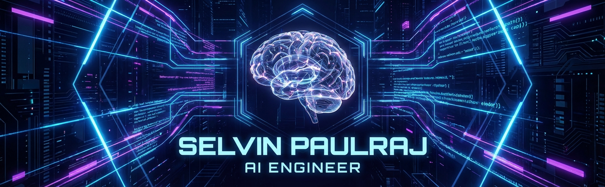
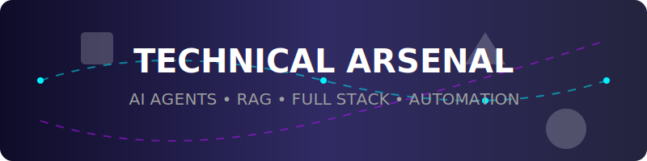
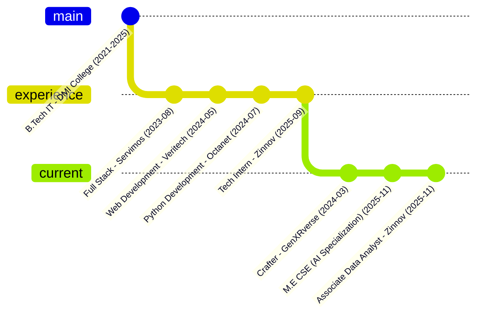

<!-- ========================== -->
<!--        HERO BANNER         -->
<!-- ========================== -->

<p align="center">
  
</p>

<!-- ========================== -->
<!--   ANIMATED TYPING HEADER   -->
<!-- ========================== -->

<h1 align="center">
  
</h1>

<!-- ========================== -->
<!--          BADGES            -->
<!-- ========================== -->

<p align="center">
  
  
  
  
</p>

<p align="center">
  <a href="https://in.linkedin.com/in/selvinpaulrajk">
    
  </a>
  <a href="https://selvinpaulraj.vercel.app">
    
  </a>
  <a href="https://selvinpaulraj.vercel.app/SPR_Resume.pdf">
    
  </a>
</p>

<p align="center">
  
</p>

<div align="center">
  
</div>

<!-- ========================== -->
<!--        ABOUT SECTION       -->
<!-- ========================== -->

## 🧠 About Me   

I'm an **AI Engineer & Associate Data Analyst** at **Zinnov (Draup)**, specializing in **autonomous AI agents, RAG systems, and intelligent automation**. With a strong foundation in full-stack development, I'm building AI-powered solutions that solve real-world enterprise challenges.

**🎯 My Mission:** Building intelligent, autonomous AI agents that solve real-world business problems and automate complex workflows using LLMs, embeddings, and multi-step reasoning.

### What I'm Working On
- 🤖 **AI Agent Development** — Building autonomous agents with `LangGraph`, `LangChain`, and `MCP`
- 🔍 **RAG & Vector Search** — Implementing `FAISS`, `Chroma`, and embedding-based similarity models
- 📊 **Enterprise AI Solutions** — Job-role intelligence, classification systems, and research automation
- 🌐 **Web Automation** — `Playwright`, async `Python`, and multi-step data pipelines
- 💼 **Agentic Systems** — Multi-agent workflows and intelligent business automation

### Background
- 🎓 **M.E. Computer Science & Engineering** (Specialization: AI & Agentic Systems) — Kings Engineering College (Aug 2025 - Present)
- 🎓 **B.Tech Information Technology** — DMI College of Engineering, Chennai (CGPA: 8.4) | May 2021 - May 2025
- 💼 **Associate Data Analyst** at Zinnov (Draup) (Sep 2025 - Present)
- 🚀 **Crafter** at GenXRverse (Mar 2024 - Present) — AI-driven automation & agentic systems
- 🌏 Based in India | Hybrid Work Environment
- 📱 **Contact:** [+91 9176299049](tel:9176299049) | [WhatsApp](https://wa.me/+919176299049)

---

<!-- ========================== -->
<!--        CTA SECTION         -->
<!-- ========================== -->

## 🚀 Visit My Professional Portfolio  

<p align="center">
  <a href="https://selvinpaulraj.vercel.app" target="_blank">
    
  </a>
</p>

---

<!-- ========================== -->
<!--    TECHNICAL SKILLS        -->
<!-- ========================== -->

## 🛠️ Technical Skills & Arsenal

<p align="center">
  </p>

### 🤖 Agentic AI & LLM Stack
<div align="left">
  
  
  
  
  
  
  
  
  
  
  
  
  
  
  
  
  
</div>

<br>

### 🧠 Data Science & Vector Search
<div align="left">
  
  
  
  
  
  
  
  
  
  
  
  
  
  
  
  
  
</div>

### 💻 Programming Languages
<div align="left">
  
  
  
  
  
  
  
  
  
  
  
  
  
</div>

### ⚛️ Frontend Development
<div align="left">
  
  
  
  
  
  
  
  
  
  
  
  
  
  
  
</div>

### 🔙 Backend & Database
<div align="left">
  
  
  
  
  
  
  
  
  
  
  
  
  
  
  
  
  
  
  
  
  
  
  
</div>

### 🛠️ DevOps, Tools & Cloud
<div align="left">
  
  
  
  
  
  
  
  
  
  
  
  
  
  
  
  
  
  
  
  
  
</div>

### 🎨 Design & Productivity
<div align="left">
  
  
  
  
  
  
  
</div>

---

<!-- ========================== -->
<!--      EXPERIENCE TIMELINE   -->
<!-- ========================== -->

## 💼 Experience Journey



### 💼 Associate Data Analyst — Zinnov (Draup)
**Sep 2025 - Present** | Arakkonam, Tamil Nadu, India (On-site)

> *Supporting AI-driven enterprise research by analyzing structured and unstructured data.*

- 🎯 **Impact**: **Improved classification and matching accuracy by 40%** through embedding-based similarity models.
- 🛠️ **Tech**: Built internal automation pipelines for job-role intelligence, cutting manual analysis time by **30%**.
- 🤝 **Collaboration**: Collaborating with cross-functional teams to deliver data-backed insights for Fortune 500 clients.

<p>
  
  
  
  
</p>

### 🔬 Tech Intern — Zinnov (Draup)
**Jun 2025 - Sep 2025** | Arakkonam, Tamil Nadu, India (On-site)

> *Built AI automation prototypes using LLMs, agentic flows, and data-driven workflows.*

- 📈 **Optimization**: **Improved research data accuracy by 35%** using automated web scraping and validation pipelines.
- ⚡ **Efficiency**: Designed internal tools to streamline business research operations, reducing manual workload by **25%**.
- 🧠 **Innovation**: Contributed to multi-step job role classification, website extraction agents, and skill-mapping systems.

<p>
  
  
  
</p>

### 🚀 Crafter — GenXRverse
**Mar 2024 - Present** | Chennai, Tamil Nadu, India (Hybrid)

> *Leading development of AI-driven automation and agentic systems.*

- 🏗️ **Architecture**: Building MVP prototypes using **LLMs, RAG, MCP** and multi-agent workflows.
- 🎨 **Product**: Managing product roadmap, technical execution, and user experience design for early adopters.

<p>
  
  
  
</p>

### 🐍 Python Development Intern — Octanet Services
**May 2024 - Jul 2024** | Remote
- Built Flask-based predictive financial model used by **1,000+ users** to estimate investment outcomes
- **Optimized computation time by 40%** using NumPy, pandas, and TensorFlow
- Created responsive frontend with HTML, JavaScript, and Firebase, improving load speed by 28%

### 🌐 Web Development Intern — Veritech Software
**Mar 2024 - May 2024** | Remote
- Created responsive React portfolio site, **boosting engagement by 35%**
- Integrated Generative-AI chatbot, **increasing interactions by 40%**
- Developed 3D landing page using Next.js and React-Spline, improving time-on-page by 25%
- Built MERN stack Expense Tracker with dynamic charts, reducing manual tracking effort by 60%

### 💻 Full Stack Intern — Servimos Technologies
**Jul 2023 - Aug 2023** | Chennai, India (On-site)
- Developed scalable MERN-stack Library Management System used by **200+ internal users**
- **Improved UI performance by 30%** through optimized component structuring and state management
- Reduced defects by 25% through collaboration with senior developers

---

<!-- ========================== -->
<!--    HONORS & AWARDS         -->
<!-- ========================== -->

## 🏆 Honors & Awards

### 🥇 Hackathons
- **1st Place** - National Level Hackathon | *Alpha College of Engineering*
- **3rd Place** - SheInnovates Hackathon | *Women Techmakers Chennai*

### 🎤 Symposiums
- **1st Place** - Website Development | *Alpha College of Engineering*
- **2nd Place** - National Level Coding | *Chennai Institute of Technology*

### 🎖️ Badges & Recognition
- **5-Star Problem Solving** (HackerRank)
- **5-Star Java** (HackerRank)
- **5-Star Python** (HackerRank)
- **5-Star 10 Days of JS** (HackerRank)
- **3-Star 30 Days of Code** (HackerRank)

---

<!-- ========================== -->
<!--      CERTIFICATIONS        -->
<!-- ========================== -->

## 📜 Certifications

| Certification | Issuer |
|--------------|--------|
| **Software Engineer** | HackerRank |
| **Full-Stack Web Developer** | LinkedIn |
| **React Developer** | HackerRank |
| **Typescript Essential Training** | LinkedIn |
| **Blockchain Developer** | LinkedIn |
| **Machine Learning with Python** | IBM |
| **Python for Data Science** | IBM |
| **Python** | Guvi |

---

<!-- ========================== -->
<!--    FEATURED PROJECTS       -->
<!-- ========================== -->

## 📦 Featured AI Projects  

### 🤖 Enterprise AI & Agent Systems

<table>
<tr>
<td width="50%">

#### 🔍 LinkedIn MCP Server
 
- **Function:** MCP server for LinkedIn integration
- Enables AI agents to interact with LinkedIn data
- [GitHub](https://github.com/selvin-paul-raj/Linkedin-MCP-Server)

</td>
<td width="50%">

#### 🧠 AI Agent MCP Server
 
- **Function:** Core MCP server for AI agent orchestration
- Manages multi-agent workflows and coordination
- [GitHub](https://github.com/selvin-paul-raj/AI-Agent-MCP-Server)

</td>
</tr>
<tr>
<td width="50%">

#### ⚡ Dynamic AI Agent CLI System
 
- **Function:** Command-line interface for AI agent management
- Dynamic agent creation and task orchestration
- [GitHub](https://github.com/selvin-paul-raj/Dynamic-AI-Agent-CLI-System)

</td>
<td width="50%">

#### 🎨 AI Calculator
 
- **Function:** Draw-to-calculate AI interface
- Real-time AI-powered calculation recognition
- [](https://spr-ai-calculator.vercel.app) | [GitHub](https://github.com/selvin-paul-raj/SPR-AI-Calculator)

</td>
</tr>
</table>

### 🛡️ Security & ML Projects

<table>
<tr>
<td width="50%">

#### 🔐 Phishing Detection Extension
 
- **Function:** Real-time phishing website detection
- Machine learning-based security analysis
- [GitHub](https://github.com/selvin-paul-raj/Phishing-Detection-Extension)

</td>
<td width="50%">

#### 🚨 Phishing Detection ML FastAPI
 
- **Function:** Backend API for phishing detection
- ML model serving with FastAPI
- [GitHub](https://github.com/selvin-paul-raj/Phishing_Detection_ML_FastAPI)

</td>
</tr>
<tr>
<td width="50%">

#### 🎭 Deepfake Video Detection
 
- **Function:** AI-powered deepfake detection system
- Advanced neural network analysis
- [GitHub](https://github.com/selvin-paul-raj/deepfake_Video)

</td>
<td width="50%">

#### ✅ TroothView
 
- **Function:** Photo authenticity verification
- AI-powered trustworthiness analysis with visual results
- [](https://trooth-view.vercel.app) | [GitHub](https://github.com/selvin-paul-raj/TroothView)

</td>
</tr>
</table>

### 📝 Content & Productivity Tools

<table>
<tr>
<td width="50%">

#### 📋 AI Content Generator
 
- **Function:** Scalable AI content generation platform
- Dynamic templates, rich text editing, PostgreSQL backend
- [GitHub](https://github.com/selvin-paul-raj/AI-Content-Generator)

</td>
<td width="50%">

#### 💬 Copy-ME
 
- **Function:** Instant text sharing across devices
- Live shared clipboard with publish/sync
- [GitHub](https://github.com/selvin-paul-raj/copy-me)

</td>
</tr>
<tr>
<td width="50%">

#### ⚙️ Vitersim
 
- **Function:** Vite React project optimizer CLI
- Automated cleanup and Tailwind setup
- [NPM Package](https://www.npmjs.com/package/vitersim) | [GitHub](https://github.com/selvin-paul-raj/vitersim)

</td>
<td width="50%">

#### ⌨️ Speed Typing
 
- **Function:** Typing test with rich animations
- Custom hooks and performance tracking
- [](https://spr-speed-typing.vercel.app) | [GitHub](https://github.com/selvin-paul-raj/Speed-Typing)

</td>
</tr>
</table>

### 🔧 Developer Tools & Utilities

- [](https://www.npmjs.com/package/spr-censorify) — NPM package for content moderation and sensitive word filtering
- [](https://github.com/selvin-paul-raj/Own_Amazon_Scraper_API) — Node.js/Express API for Amazon product data extraction
- [](https://github.com/selvin-paul-raj/Files-Share-App) — Drag-and-drop cloud file sharing with password protection
- [](https://github.com/selvin-paul-raj/-IBISWorld_Web_Scraper) — Industry data scraping tool
- [](https://github.com/selvin-paul-raj/screener_companies_Web_Scrapping) — Company data extraction tool

### 🌐 Full-Stack Web Applications

- [](https://selvin-paul-raj.vercel.app) — Next.js 14, TypeScript, Framer Motion, Vercel Analytics
- [](https://github.com/selvin-paul-raj/Gift-Buddy) — AI-powered gift recommendation engine
- [](https://github.com/selvin-paul-raj/EzSumZ-Article_Summarizer-React-App) — OpenAI GPT-4 powered article summarization
- [](https://github.com/selvin-paul-raj/Food-Delivery-Website) — Full-stack food ordering platform
- [](https://github.com/selvin-paul-raj/MERN-Blog) — Complete blogging platform with MERN stack
- [](https://github.com/selvin-paul-raj/codealpha_expense_tracker) — Financial tracking with analytics

**[View All 40+ Projects on GitHub](https://github.com/selvin-paul-raj?tab=repositories)**

---

## 📊 GitHub Analytics

<div align="center">
  
### Contribution Stats
  
[](https://git.io/streak-stats)

### Performance Metrics


</div>

---

<!-- ========================== -->
<!--         TROPHIES           -->
<!-- ========================== -->

## 🏆 GitHub Trophies  
<p align="center">
  
</p>

---

## 💡 Quick Facts

```python
class SelvinPaulRaj:
    def __init__(self):
        self.name = "Selvin PaulRaj K"
        self.location = "India"
        self.current_roles = [
            "Associate Data Analyst @ Zinnov (Draup)",
            "Crafter @ GenXRverse",
            "M.E. CSE Student (AI Specialization)"
        ]
        self.education = {
            "masters": "M.E. CSE (AI & Agentic Systems) - Kings Engineering College (2025-Present)",
            "bachelors": "B.Tech IT - DMI College of Engineering (CGPA: 8.4)"
        }
        
        self.ai_stack = {
            "llms": ["Gemini", "GPT", "Llama"],
            "agents": ["LangGraph", "LangChain", "MCP (Model Context Protocol)"],
            "vector_db": ["FAISS", "Chroma", "Pinecone"],
            "embeddings": ["SentenceTransformers", "Gemini Embeddings", "Similarity Models"],
            "automation": ["Playwright", "Async Python", "Serper", "Web Scraping"],
            "ml_frameworks": ["PyTorch", "TensorFlow", "Scikit-learn"]
        }
        
        self.full_stack = {
            "frontend": ["React", "Next.js 15", "TypeScript", "Three.js", "Angular", "Tailwind CSS"],
            "backend": ["Node.js", "Python", "Express", "Flask", "FastAPI"],
            "databases": ["MySQL", "MongoDB", "PostgreSQL", "Firebase"],
            "tools": ["Git", "Docker", "Vercel", "Postman", "VS Code"]
        }
        
        self.achievements = {
            "work_impact": [
                "40% improvement in classification accuracy (embedding models)",
                "35% improvement in research data accuracy (AI automation)",
                "30% manual analysis time reduction (automation pipelines)"
            ],
            "open_source": [
                "vitersim - Vite React optimizer CLI (NPM)",
                "spr-censorify - Content moderation package (NPM)",
                "LinkedIn MCP Server",
                "AI Agent MCP Server",
                "40+ GitHub projects"
            ],
            "certifications": ["LeetCode", "HackerRank", "GeeksForGeeks", "CodeChef"]
        }
        
        self.current_focus = [
            "Building autonomous AI agents for enterprise automation",
            "RAG systems with embedding-based similarity search",
            "Multi-step reasoning pipelines using LangGraph",
            "MCP servers for AI agent orchestration",
            "Job-role intelligence and classification systems"
        ]
    
    def current_mission(self):
        return """Building intelligent AI agents that solve real-world enterprise problems 
        through autonomous reasoning, semantic search, and intelligent automation"""
    
    def fun_fact(self):
        return "In JavaScript, [] == ![] evaluates to true 🤯"
    
    def contact_info(self):
        return {
            "linkedin": "https://www.linkedin.com/in/selvinpaulraj",
            "github": "https://github.com/selvin-paul-raj",
            "portfolio": "https://selvin-paul-raj.vercel.app",
            "phone": "+91 9176299049",
            "resume": "https://selvinpaulraj.vercel.app/SPR_Resume.pdf"
        }
```

---

## 📚 Technical Blog & Insights

<details>
<summary><b>🎯 Areas of Expertise</b></summary>
<br>

### 🧠 AI & Machine Learning
- 🤖 **Autonomous AI Agents** — Multi-step reasoning, decision trees, state management
- 🔍 **RAG Systems** — Vector databases, semantic search, embedding models
- 🧠 **LLM Integration** — Prompt engineering, model fine-tuning, API orchestration
- 🔌 **MCP Development** — Model Context Protocol servers, agent coordination

### 📊 Data Science & Analytics
- 📉 **Embedding-Based Models** — Similarity search, classification, clustering
- 🕸️ **Web Scraping & Automation** — `Playwright`, async `Python`, data pipelines
- 🕵️ **Research Intelligence** — Job-role classification, skill mapping, entity extraction
- 📈 **Data Visualization** — Analytics dashboards, insight generation

### 💻 Full-Stack Development
- ⚛️ **Modern Frontend** — `React 18+`, `Next.js 15`, `TypeScript`, Server Components
- 🔙 **Backend Architecture** — `Node.js`, `Python`, `FastAPI`, `Express`, microservices
- 🗄️ **Database Design** — SQL/NoSQL optimization, vector databases, indexing
- ☁️ **DevOps** — `Docker`, CI/CD, cloud deployment, monitoring

</details>

<details>
<summary><b>🚀 Innovation Highlights</b></summary>
<br>

### 🚀 Enterprise AI Solutions @ Zinnov
- 🎯 Developed embedding-based classification models achieving **40% accuracy improvement**
- ⚡ Built automated research pipelines reducing manual analysis time by **30%**
- 🤖 Created multi-step agentic workflows for job-role intelligence
- 🕷️ Implemented web scraping systems improving data accuracy by **35%**

### 🌟 Open Source Contributions
- 🔌 **MCP Servers** — LinkedIn integration, AI agent orchestration
- 🛠️ **CLI Tools** — `vitersim` (NPM), Dynamic AI Agent System
- 🛡️ **Security Tools** — Phishing detection ML models, deepfake detection
- 📦 **Developer Utilities** — Content moderation, web scraping APIs

### 🔬 Research & Learning
- 🎓 Pursuing **M.E. in AI & Agentic Systems**
- 🧠 Exploring distributed AI agent architectures
- 🔍 Researching RAG optimization techniques
- ✍️ Contributing to AI/ML community knowledge

</details>

---

## 🎓 Education & Continuous Learning

<table>
<tr>
<td width="50%">

### 🎓 M.E. Computer Science & Engineering
**Kings Engineering College**  
*Aug 2025 - Present*

**Specialization:** Artificial Intelligence & Agentic Systems

**Focus Areas:**
- Autonomous Agent Architectures
- Distributed AI Systems
- Advanced Machine Learning
- Intelligent Automation

</td>
<td width="50%">

### 🎓 B.Tech Information Technology
**DMI College of Engineering**  
*May 2021 - May 2025*

**CGPA:** 8.4

**Key Projects:**
- AI-powered applications
- Full-stack web development
- Machine learning models
- Automation systems

</td>
</tr>
</table>

---

## 🐾 My Git Pets  
<p align="center">
  
</p>

---

## 🌟 Coding Profiles & Achievements

<p align="center">
  <a href="https://leetcode.com/u/selvinpaulraj/">
    
  </a>
  <a href="https://www.hackerrank.com/profile/selvinpaulraj">
    
  </a>
  <a href="https://www.geeksforgeeks.org/user/selvinpaulrajk/">
    
  </a>
  <a href="https://www.codechef.com/users/selvinpaulraj">
    
  </a>
</p>

<p align="center">
  <a href="https://www.linkedin.com/in/selvinpaulraj">
    
  </a>
  <a href="https://github.com/selvin-paul-raj">
    
  </a>
</p>

---

## 📫 Connect with Me  

<p align="center">
  <b>Let's collaborate on AI agents, RAG systems, or discuss enterprise AI solutions!</b><br>
  Open to opportunities in AI Engineering, ML Research, and Autonomous Systems
</p>

<p align="center">
  <a href="https://www.linkedin.com/in/selvinpaulraj">
    
  </a>
  <a href="https://selvin-paul-raj.vercel.app">
    
  </a>
  <a href="https://selvinpaulraj.vercel.app/SPR_Resume.pdf">
    
  </a>
</p>

<p align="center">
  <a href="https://wa.me/+919176299049">
    
  </a>
  <a href="tel:9176299049">
    
  </a>
  <a href="https://github.com/selvin-paul-raj">
    
  </a>
</p>

<p align="center">
  <a href="https://leetcode.com/u/selvinpaulraj/">
    
  </a>
  <a href="https://www.hackerrank.com/profile/selvinpaulraj">
    
  </a>
  <a href="https://www.geeksforgeeks.org/user/selvinpaulrajk/">
    
  </a>
</p>

---

## ⭐ Star History  
<p align="center">
  
</p>

---

<div align="center">

### 💬 Let's Build the Future of AI Together!

*"The best way to predict the future is to invent it." – Alan Kay*

**Interested in AI Agents, RAG Systems, or Enterprise AI Solutions?**  
**Building autonomous systems that think, learn, and act.** 🚀

---

<p align="center">
  
</p>

<p align="center">
  © 2025 Selvin PaulRaj K | AI Engineer @ Zinnov | Crafter @ GenXRverse<br>
  <i>Specializing in Autonomous AI Agents, RAG Systems & Enterprise Automation</i>
</p>

</div>
